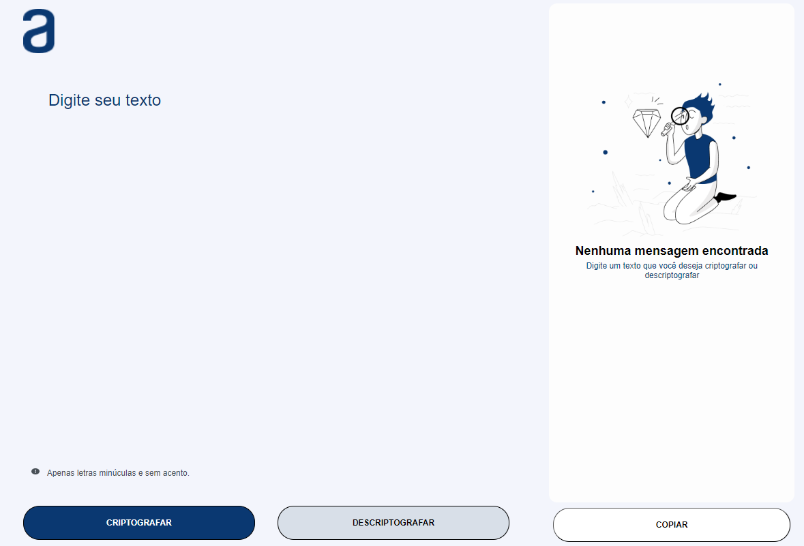
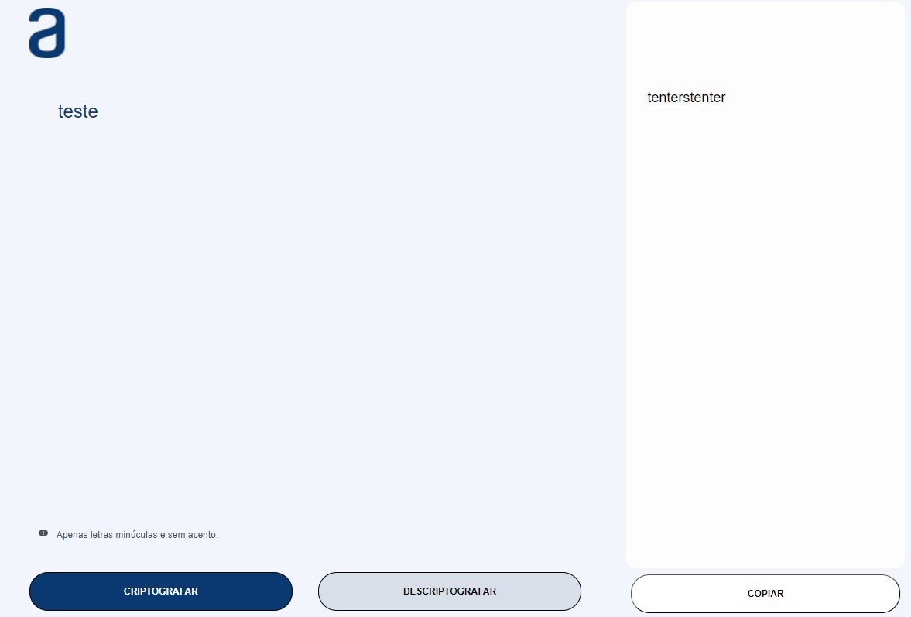
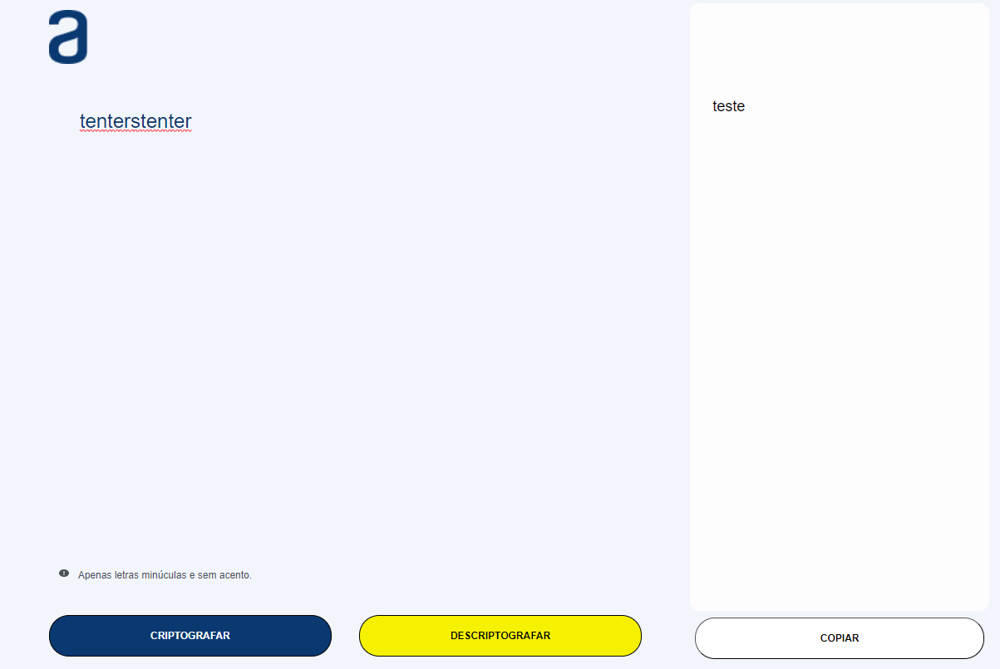

<h1 align="center">Challenge ONE - Decodificador de texto - Turma 7</h1>

<p>
    O objetivo deste desafio era desenvolver um decodificador de texto com HTML, CSS e JavaScript, onde o usuário digita um texto, criptografa, visualiza o texto criptografado e depois consegue voltar o texto para o formato original.
</p>

## Sobre o desafio
### Descrição

> A ideia é utilizar uma chave criptográfica para criptografar e descriptografar a mensagem que o usuário escolher.

> A "chave" de criptografia utilizada é:

> - A letra "a" é convertida para "ai"
> - A letra "e" é convertida para "enter"
> - A letra "i" é convertida para "imes"
> - A letra "o" é convertida para "ober"
> - A letra "u" é convertida para "ufat"

### Condições:
> - Deve funcionar apenas com letras minúsculas, em acentos e sem caractyeres especiais

> Exemplos:
```Js
    "teste" => "tenterstenter"
    "gato que mia quando esta com fome" => "gaitober qufatenter mimesai qufataindober enterstai coberm fobermenter"
```

> - O usuário pode escolher entre criptografar uma mensagem normal, respeitando as condições.
> - O usuário pode descriptografar uma mensagem já criptografada.

## Testes da aplicação
<p align="center" >
    
</p>
<p>
    Tive pouco tempo para realizar o teste até a ata proposta, então resolvi fazer a aplicação funcionar e ter uma aparência semelhante ao que
    foi proposto no desafio.
</p>

<p align="center" >
    
</p>
<p>
    Teste da aplicação criptografando a palavra "teste".
</p>

<p align="center" >
    
</p>
<p>
    Teste da aplicação descriptografando a palavra "tenterstenter".
</p>